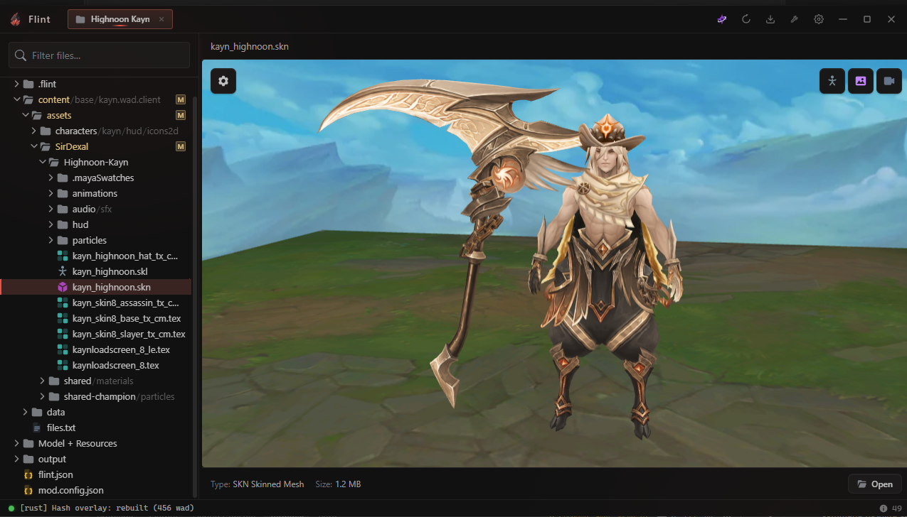
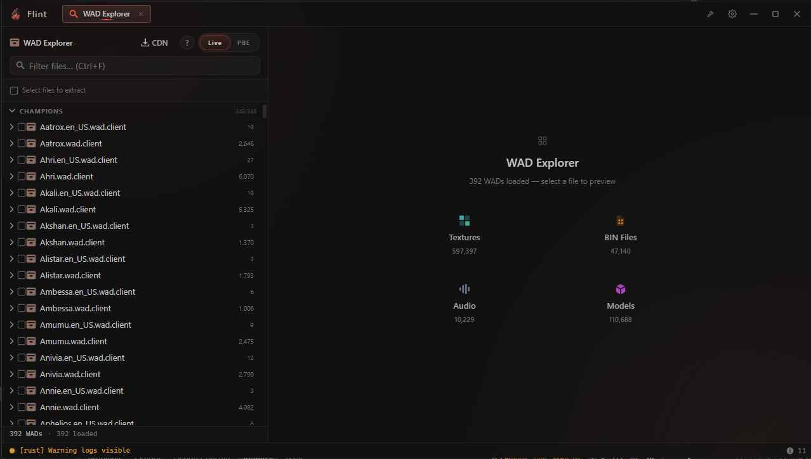
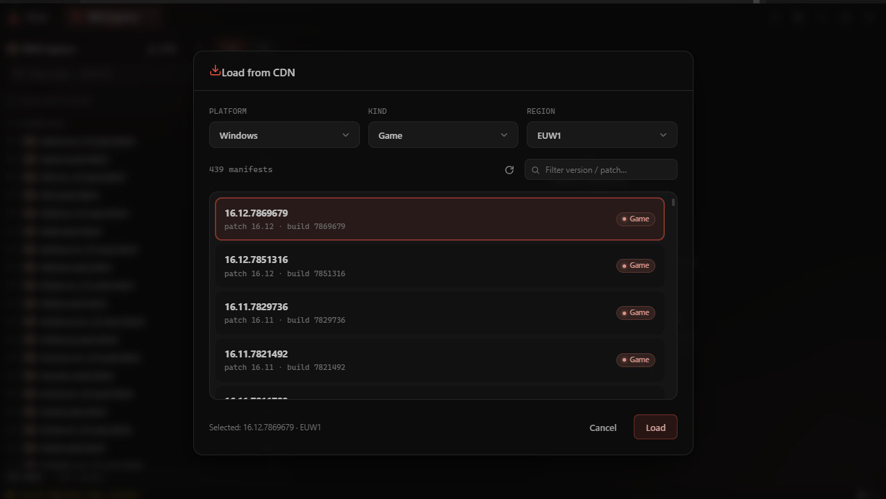
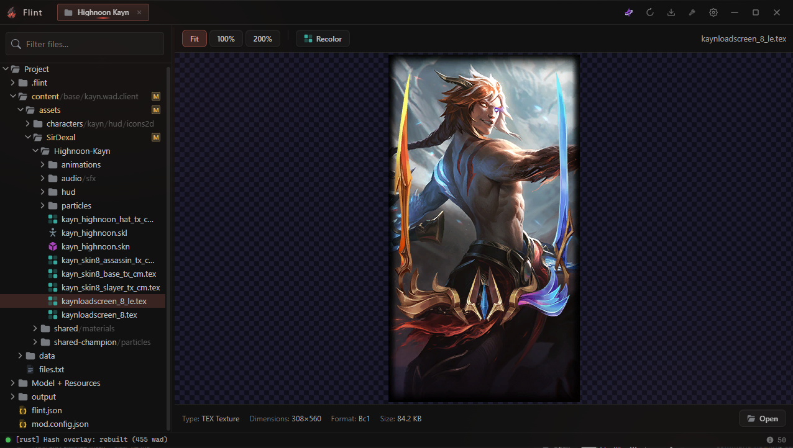
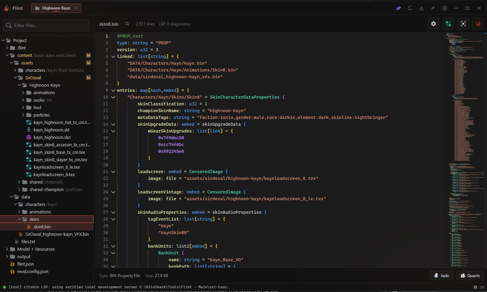

<div align="center">


[](https://www.rust-lang.org/)
[](https://tauri.app/)
[](https://react.dev/)
[](https://github.com/RitoShark/Flint/releases/latest)
[](LICENSE)

[Download](#download) · [Features](#features) · [License](#license)

</div>

---

Point Flint at your League install, pick a skin, and you get a real project. Files on disk,
previews that render properly, editors for the formats League actually uses, and an export that
produces something installable.

---

## Features

<details open>
<summary><b>Projects</b> · pull a skin out of the game and get something you can work on</summary>

<br>



Pick a champion and a skin. Flint extracts it, repaths it onto your own asset folder, and lays it
out as a project instead of a heap of files named after hashes.

- Chromas and sub-characters come along with it.
- Checkpoints snapshot the whole project before a risky change, and roll it back when the change
  turns out to be a mistake. They survive restarts.
- Importing works the other way. Drop in a `.fantome` or `.modpkg` and Flint recovers the shared
  BINs Riot moved between patches, re-resolves the hashes, and pulls anything still missing back
  out of your install.
- Port a skin to League Classic, strip it down for NoSkinLite, or push a base skin's edits across
  all of its chromas.

<br clear="all">

</details>

<details>
<summary><b>WAD explorer</b> · browse the whole game like a folder</summary>

<br>



Every WAD in the game, in a tree that expands instantly instead of making you wait for a full
index to build.

- One search box. Type an extension, a substring, or a regex, with no mode to switch.
  Results stay collapsed so a common word doesn't bury you.
- Names resolve to readable paths, so you're not reading hex.
- Tick the files you want and extract them, or pull a whole folder at once.

<br clear="all">

</details>

<details>
<summary><b>CDN</b> · pull a patch straight from Riot without installing it</summary>

<br>



Pick a platform, a kind and a region, and Flint lists every manifest Riot is serving, by patch and
build number.

Load one and it browses exactly like a local WAD, so you can pull an asset from a patch you don't
have installed, or compare something against a build you've already moved past. Manifests you've
already downloaded are marked.

<br clear="all">

</details>

<details>
<summary><b>Preview</b> · look at things before you break them</summary>

<br>



- **Models**: SKN, SKL, SCB and SCO, with skeletons and animations, framed correctly whether it's
  Teemo or Cho'Gath.
- **Textures**: DDS and TEX decoded from raw bytes, BC7 included.
- **Audio**: BNK, WPK and WEM on a waveform you can zoom into and cut.
- **Maps**: in their own window.
- **The rest**: BIN, ritobin, troybin, luabin, RST string tables, inibin and cfgbin, manifests.
  Most of them are editable, not just readable.

Every preview tells you what the file actually is, down to a texture's real format and dimensions,
so you find out something is a `Bc1` 308×560 before you spend an hour on it.

<br clear="all">

</details>

<details>
<summary><b>BIN editing</b> · a real editor, not a text box</summary>

<br>



Monaco with a proper ritobin language behind it: highlighting, folding, a minimap, and bracket
checking that understands blocks instead of counting braces, so it only speaks up when something
is genuinely unbalanced.

- **Unhash** in one click, and names you make up yourself stick to the file.
- An emitter palette for VFX work, so you can copy or drag emitters between files.
- A VFX paint panel for recoloring particles without hand-editing values.
- Compare two BINs properly, whole file, not a selection of hunks.
- An optional [ritobin language server](docs/ritobin-lsp.md) for completion and diagnostics. Off by
  default, and it downloads no hashes of its own. Names come from your local database.

<br clear="all">

</details>

<details>
<summary><b>Textures and meshes</b> · get a skin ready to paint on</summary>

<br>

- Cut a skin's textures into Photoshop layers along their UV islands, so you paint on the parts
  instead of on one flat atlas.
- Toggle submeshes on and off in the preview to see what a piece of the model actually is.
- Convert PNGs to TEX or DDS on the way in. DDS export is deliberately limited to the formats
  League's loader can read, because a BC7 DDS crashes the client, so Flint won't write one.

</details>

<details>
<summary><b>Thumbnails and loadscreens</b> · the art side</summary>

<br>

- **Thumbnail studio**: pose the model, pick a background, add text and shapes, export a PNG for
  the mod post.
- **Animated loading screens**: drop in a video and get a working one out. Spritesheet packing,
  texture budget, FPS trim and the UI BIN patching all happen for you.
- **Loadscreen banner**: turn a static loadscreen into an animated one, with a mask painter for
  the parts that should show through.
- **Recolor**: hue shift, colorize or tint a whole folder at once. It skips distortion maps and
  keeps alpha, so it doesn't quietly wreck your normals.

</details>

<details>
<summary><b>Checking and fixing</b> · find out what's broken before the player does</summary>

<br>

**Check files** scans the project and tells you what's wrong: references pointing at nothing, the
things that actually crash the client, files nothing uses, and fields Riot retyped in a patch that
your mod hasn't followed.

Findings open where they really are. The file gets selected in the tree, and a BIN finding opens
at its line.

**Skin Fixer** runs Hematite across one or more projects. It scans first and shows you what it
found before it touches anything, and takes a checkpoint before it runs.

</details>

<details>
<summary><b>Shipping</b> · get it out of Flint</summary>

<br>

Export a `.fantome` or a `.modpkg`, or sync straight into the **Celestial** launcher or **LTK
Manager**.

Export warns you about references pointing at files that aren't in the package, rather than
producing a mod that silently loads nothing.

You can also hand a BIN off to Jade or a texture to Quartz without moving files around yourself.

</details>

---

## Download

Grab the latest build from the [releases page](https://github.com/RitoShark/Flint/releases/latest),
run the installer, and you're done. It updates itself after that.

> [!NOTE]
> Flint needs a League install for anything that reads game files: extraction, previews, and
> recovering missing files on import. Editing a project you already have works without one.

<details>
<summary><b>Build it yourself</b></summary>

<br>

Needs Rust (stable), Node 20, and Windows 10 or 11.

```bash
git clone https://github.com/RitoShark/Flint
cd Flint
npm install
npm run tauri dev
```

`npm run tauri build` produces an installer at
`src-tauri/target/release/bundle/nsis/Flint_<version>_x64-setup.exe`.

</details>

## Notes

- The in-game shader replication comes from a closed source repo. It is not public and is not
  going to be.
- This project is not affiliated with Riot Games. League of Legends and its assets belong to Riot.
- See [CONTRIBUTING.md](CONTRIBUTING.md) if you want to send a PR.

## Credits

- **Obsidian** for the WAD explorer.
- **Morilli** and **[moonshadow565](https://github.com/moonshadow565)** for the CDN work this is
  built on.
- **[CommunityDragon](https://www.communitydragon.org)** and
  **[lmdb-hashes](https://github.com/RitoShark/lmdb-hashes)** for the hashes.
- **Frog** for the map project creation, and **DAKA** for help on the repo.
- **[LtMAO](https://github.com/tarngaina/LtMAO)** by
  [tarngaina](https://github.com/tarngaina). Its `animask_viewer` and `sborf` were the reference
  for Flint's animation mask editor, and confirmed that `mWeightList` is indexed by SKL joint
  order.

## License

[AGPL-3.0](LICENSE). Free to use, study, modify and share.

If you distribute a modified version, or run one somewhere other people use it over a network, you
have to release your source under the same license.
