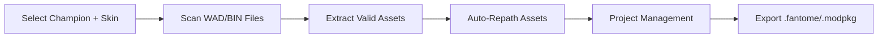

# Flint - Project Overview

> A modern League of Legends modding IDE built with Rust + Tauri that cuts modding workflow time in half by automating asset extraction, repathing, and mod packaging.

---

## What is Flint?

Flint is a comprehensive modding IDE designed specifically for League of Legends. It streamlines the entire modding workflow by automating the most tedious and error-prone tasks that modders currently perform manually.

## Core Problem It Solves

Currently, League of Legends modders must manually:

| Manual Task | Pain Point |
|------------|------------|
| Extract champion assets from WAD files | Complex file format, buried assets |
| Parse BIN files to find asset references | Cryptic binary format, hash lookups |
| Deal with missing files and broken paths | No validation, trial-and-error debugging |
| Manually repath assets | Change prefixes in BIN + move files |
| Package mods in correct formats | Format specifications, compatibility issues |

**Flint automates all of this.**

## How It Works



1. **User selects Champion + Skin** - Simple UI selection
2. **Flint reads League installation WAD/BIN files** - Automatic path detection
3. **Extracts ONLY existing assets** - Validation checks prevent missing files
4. **Performs automatic repathing** - Asset prefix modification + file relocation
5. **Manages everything through project workflow** - Organized project structure
6. **Exports to .fantome or .modpkg formats** - Both legacy and modern support

---

## Key Technologies

| Technology | Purpose |
|-----------|---------|
| **Rust** | Backend performance, safety, and reliability |
| **Tauri 2.x** | Cross-platform desktop framework (Windows/Mac/Linux) |
| **league-toolkit** | WAD archive operations |
| **Vite + Web Stack** | Modern, fast frontend development |

### File Formats Handled

- **WAD** - Riot's archive format containing game assets
- **BIN/ritobin** - Property files with asset metadata and paths
- **DDS** - DirectDraw Surface textures
- **SKN/SKL** - Model and skeleton files

### Export Formats

- **.fantome** - Legacy mod format (wide compatibility)
- **.modpkg** - Modern format via league-mod (newer tools)

---

## UI Philosophy

```
┌────────────────────────────────────────────────────────────┐
│  [Project Name]           [Configure]  [Export Mod ▼]      │
├──────────────────┬─────────────────────────────────────────┤
│                  │                                         │
│  📁 particles    │                                         │
│  📁 characters   │       Center Panel                      │
│  📁 audio        │       (Preview / BIN Editor)            │
│  📂 textures     │                                         │
│    ├── base.dds  │                                         │
│    └── mask.dds  │                                         │
│                  │                                         │
├──────────────────┴─────────────────────────────────────────┤
│  Left Panel:         Center Panel:                         │
│  File Tree View       Dynamic content area                 │
│  with categories      switches between preview and editor  │
└────────────────────────────────────────────────────────────┘
```

### Design Principles

- **Left Panel**: File tree with categories (particles, characters, audio, etc.)
- **Center Panel**: Dynamic preview/editor area
- **Top Bar**: Project info + Configure + Export buttons
- **NO RIGHT SIDEBAR** - Clean and focused interface

---

## Key Features

### MVP Features

1. **Project-based mod management** - Organized workspace for each mod
2. **Automatic WAD/BIN scanning** - Detect and parse League installations
3. **Asset extraction with validation** - Only extract files that exist
4. **Intelligent repathing engine** - Automatic asset prefix modification
5. **Asset preview system** - View textures, models, and other assets

### Future Features

6. **BIN editor** - Modify property values and paths
7. **Dual export format support** - Both .fantome and .modpkg
8. **league-mod repository integration** - Community mod sharing

---

## Target Users

- **Experienced modders** - Looking to speed up repetitive tasks
- **New modders** - Want guided workflows without learning every format
- **Content creators** - Need efficient iteration on skin modifications

---

## Project Status

**Current State**: Core backend implemented with:
- Hash table management (CommunityDragon integration)
- WAD file reading and extraction
- BIN file parsing and conversion

**Next Steps**: Frontend implementation and workflow integration
