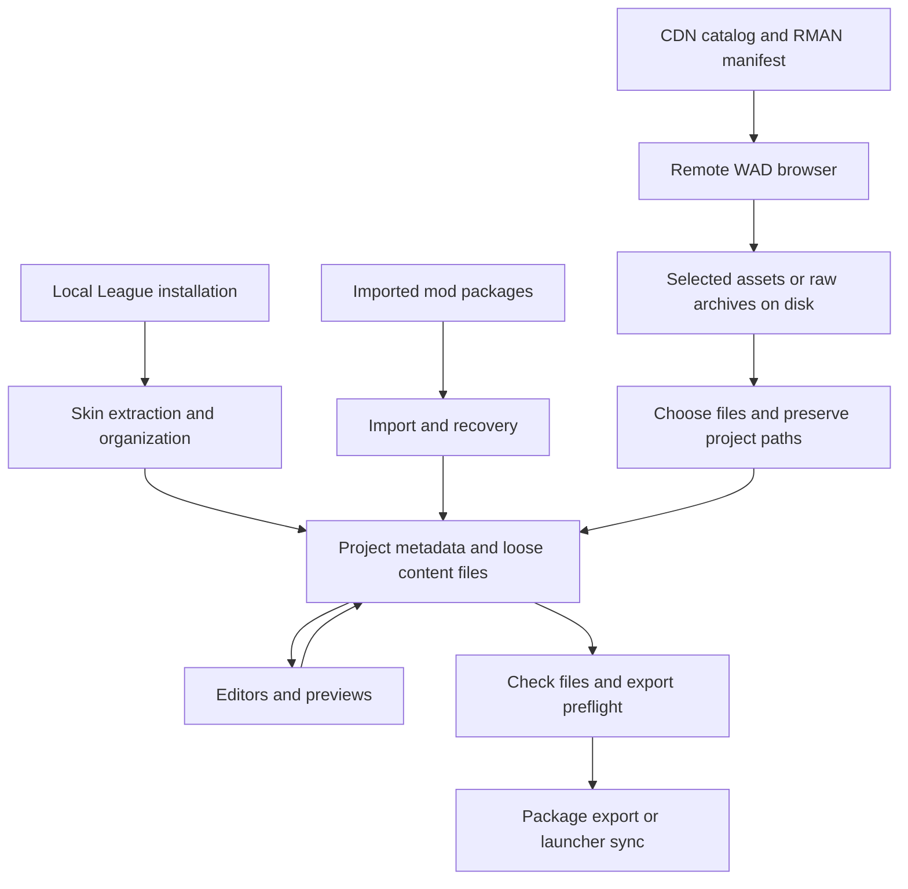

# How Flint works

[Documentation index](README.md)

Flint connects editable project files to League's binary formats. Its React frontend presents projects, trees, editors and previews. Tauri commands connect those controls to Rust code that reads archives, decodes formats, manages project files, and writes packages.

## Main data flow

The source matters: local skin creation performs dependency extraction and organization; CDN browsing retrieves explicitly selected files. Neither previewing a file nor loading a manifest creates a mod package.

## Which part does what?

| Component | Responsibility | Source |
|---|---|---|
| React components | Dialogs, project/file navigation, editor interaction and preview presentation | [src/components](../src/components) |
| Frontend API wrappers | Typed calls and binary transfers to Tauri commands | [src/lib/api](../src/lib/api) |
| Frontend stores | Open tabs, selection, configuration and manifest UI state | [src/lib/stores](../src/lib/stores) |
| Tauri command layer | IPC entry points, background work, application state and progress events | [src-tauri/src/commands](../src-tauri/src/commands) |
| `flint-core` | Project creation/loading, indexing, repath/organization and checkpoints; also re-exports supporting modules | [flint-core](../src-tauri/crates/flint-core/src) |
| `flint-net` | Network-facing functionality, including CDN catalogs, manifests and downloads | [flint-net](../src-tauri/crates/flint-net/src) |
| `flint-wad` | WAD browsing/extraction and related archive operations | [flint-wad](../src-tauri/crates/flint-wad/src) |
| `flint-bin` | BIN conversion, editing support and checks | [flint-bin](../src-tauri/crates/flint-bin/src) |
| `flint-hash` | Shared hash lookup infrastructure | [flint-hash](../src-tauri/crates/flint-hash/src) |
| `flint-formats` | Format-facing functionality used by the application | [flint-formats](../src-tauri/crates/flint-formats/src) |
| `hematite-flint` | Integration with the Hematite skin-fixing engine | [hematite-flint](../src-tauri/crates/hematite-flint/src) |
| RitoShark crates | Underlying readers/writers for game formats such as BIN, WAD, RMAN, meshes and textures | Pinned in the [Rust workspace manifest](../src-tauri/Cargo.toml) |

A Rust command importing `flint_core::cdn` can therefore lead to an implementation under `flint-net/src/cdn`. Follow the re-export when locating the actual behavior.

## Persistent files versus active state

Project files are the working source of truth. `mod.config.json` stores shared mod metadata; `flint.json` stores Flint identity and provenance. The project-root index `projects.json` supports discovery. Checkpoints live with the project under `.flint`.

Open tabs and selected tree nodes are UI state. A CDN session ID identifies a parsed manifest held by the running backend; it is not a reusable project ID. Catalogs and downloaded manifests have their own disk cache, while selected downloads go to the user's chosen destination.

Project file watching lets external edits reach the application. Flint suppresses echoes of its own writes to avoid rereading the same edit in a loop; editor save paths also trigger relevant rechecks. An audit finding is derived from files and references, not stored as a permanent property of an asset.

## Core operations

**Extract** reads assets out of an archive. **Decode/encode** converts a format between bytes and an editable representation. **Concat** merges linked BIN content. **Repath** rewrites references and moves assets into the matching namespace. **Audit** reports problems. **Export** packages project content for installation. Each is a distinct operation; downloading or editing one file does not implicitly run all the others.

For practical detail, read [projects](projects.md), [formats and references](formats-and-references.md), and [CDN downloads](cdn.md). Dated files in `superpowers/` are design history and may describe behavior that differs from the current implementation.
